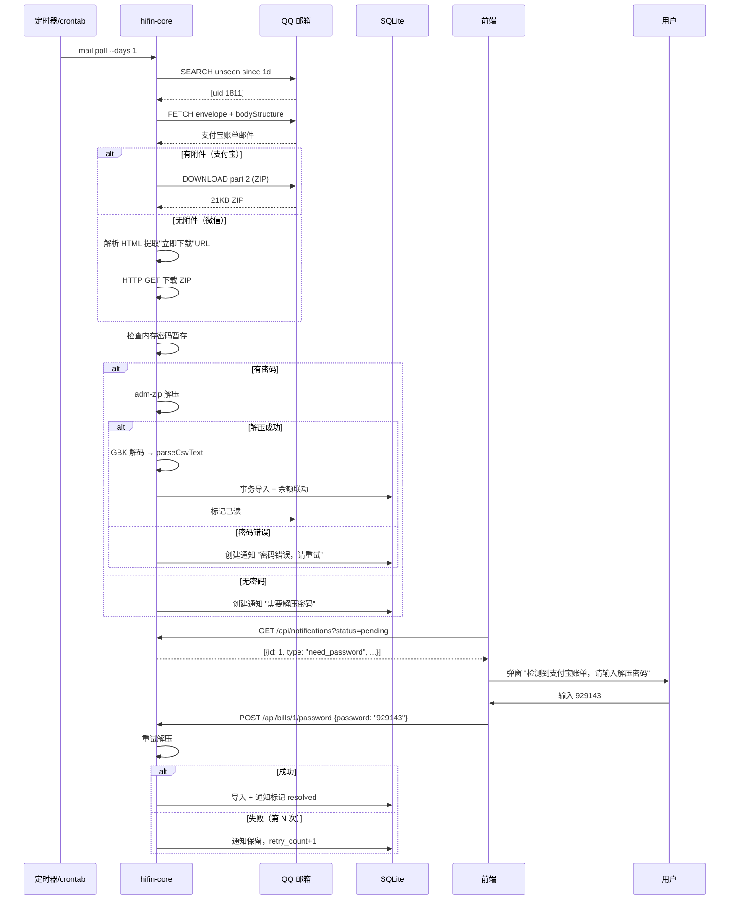
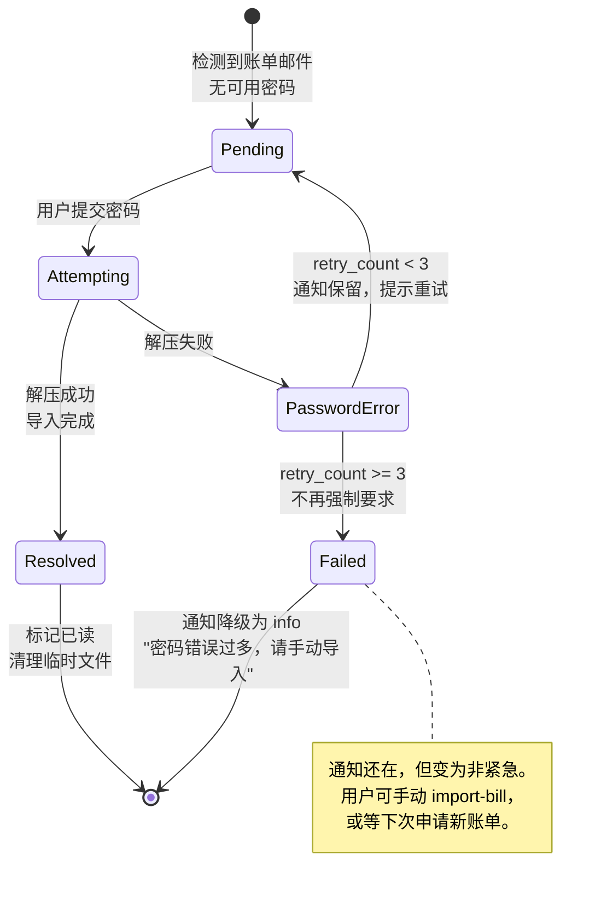

# HiFin 账单自动化系统 — 完整流程设计

## 一、核心认知（MVP 实测结论）

| 平台 | 邮件类型 | 附件 | 密码获取 |
|---|---|---|---|
| **支付宝** | 通知型 | ✅ 有 ZIP 附件 | 短信/另一封邮件，一次性 |
| **微信** | 通知型 | ❌ 无附件，正文有"立即下载"URL | 短信/另一封邮件，一次性 |

**关键约束**：解压密码是一次性的，每次申请账单都不同。不能硬编码、不能持久化。

---

## 二、系统架构

```mermaid
flowchart TD
    subgraph 外部["外部世界"]
        QQ[QQ 邮箱 IMAP]
        User[用户]
    end

    subgraph Core["hifin-core (Node 常驻)"]
        Poller[MailPoller<br/>IMAP 轮询/IDLE]
        Detector[平台识别器<br/>alipay / wechat]
        Downloader[附件下载器]
        URLExtractor[微信 URL 提取器<br/>解析 HTML 找下载链接]
        Unzipper[ZIP 解压器<br/>adm-zip + 密码]
        Parser[CSV 解析器<br/>GBK 解码 + 表头定位]
        Importer[事务导入器<br/>余额联动 + 规则分类]
        Notifier[通知引擎]
        PWDStore[密码暂存器<br/>内存 Map，不持久化]
    end

    subgraph DB[("SQLite")]
        TX[(transactions)]
        ACC[(accounts)]
        NOTIF[(notifications)]
    end

    subgraph Web["Web SPA / Tauri"]
        UI[通知弹窗]
        PWDInput[密码输入框]
    end

    QQ -->|新邮件| Poller
    Poller --> Detector
    Detector -->|alipay 有附件| Downloader
    Detector -->|wechat 无附件| URLExtractor
    URLExtractor -->|下载 ZIP| Downloader
    Downloader --> Unzipper
    Unzipper -->|需要密码| PWDStore
    PWDStore -->|用户提供| Unzipper
    Unzipper -->|解压成功| Parser
    Parser --> Importer
    Importer --> TX
    Importer --> ACC

    Unzipper -->|密码错误| Notifier
    Unzipper -->|无密码| Notifier
    Notifier --> NOTIF
    NOTIF -->|轮询| UI
    UI -->|用户输入密码| PWDInput
    PWDInput -->|POST /api/bills/:id/password| PWDStore
```

---

## 三、主流程（时序图）



---

## 四、密码重试状态机



---

## 五、通知系统设计

### 数据表

```sql
CREATE TABLE notifications (
  id INTEGER PRIMARY KEY AUTOINCREMENT,
  type TEXT NOT NULL,           -- need_password / password_error / import_success / import_failed
  title TEXT NOT NULL,
  message TEXT,
  bill_uid INTEGER,             -- 关联的邮件 UID
  platform TEXT,                -- alipay / wechat
  status TEXT DEFAULT 'pending', -- pending / resolved / dismissed / failed
  retry_count INTEGER DEFAULT 0,
  createdAt INTEGER NOT NULL,
  updatedAt INTEGER NOT NULL
);
```

### REST API

| 端点 | 说明 |
|---|---|
| `GET /api/notifications?status=pending` | 前端轮询待处理通知 |
| `POST /api/notifications/:id/resolve` | 标记已解决 |
| `POST /api/notifications/:id/dismiss` | 用户忽略 |
| `POST /api/bills/:uid/password` | 用户提交密码，触发重试 |

### 前端交互

1. 每 30 秒轮询 `GET /api/notifications?status=pending`
2. 有 `need_password` 类型 → 弹窗显示账单信息 + 密码输入框
3. 用户提交 → POST 密码 → 显示"正在解压..."
4. 成功 → 绿色提示"已导入 N 笔"
5. 失败 → 红色提示"密码错误，还剩 N 次机会"（N = 3 - retry_count）
6. 3 次都失败 → 灰色提示"密码错误过多，请手动下载导入"

---

## 六、与当前代码的映射

| 已有模块 | 需新增/修改 |
|---|---|
| `mail/poller.ts` | 微信 URL 提取（解析 HTML 找下载链接） |
| `bill/unzip.ts` | ✅ 已有，密码从参数传入 |
| `bill/importer.ts` | ✅ 已有，GBK 解码 + 表头定位 |
| `mail/importer.ts` | ✅ 已有，事务导入 |
| **新增** `notifications/` | 通知表 + REST + 轮询 |
| **新增** `bill/password-store.ts` | 内存 Map 暂存密码（uid → password），不持久化 |
| CLI `mail poll` | 检测到无密码邮件时，创建通知而非报错 |

---

## 七、关键设计决策

| 决策 | 理由 |
|---|---|
| 密码不持久化 | 一次性密码，存了也没用 |
| 密码内存暂存 | 用户提交后，poller 重试时能用，但重启即丢 |
| 3 次重试上限 | 防暴力破解，也防用户反复输错烦 |
| 3 次后降级为 info | 不阻塞其他邮件，用户可手动处理 |
| 通知表在 SQLite | 与数据同生命周期，REST 直接读 |
| 微信 URL 提取 | 微信无附件，必须解析 HTML 下载链接 |
| 支付宝直接下载附件 | 有附件，最简单 |

---

## 八、下一步实现优先级

> **实施状态（2026-10-03）**：P0/P1 全部落地（URL 提取、通知表+REST、前端密码弹窗、3 次重试状态机）。
> 此外已超出本文档范围完成的：账单分类列映射（`bill/category-map.ts`）、`(source, externalId)`
> 确定性去重、规则引擎方向闸门。P2 两项仍在路线图待决策。

| 优先级 | 任务 | 工作量 |
|---|---|---|
| P0 | 微信 URL 提取器（解析 HTML 找下载链接） | 小 |
| P0 | 通知表 + REST API | 中 |
| P1 | 前端通知弹窗 + 密码输入 | 中 |
| P1 | 密码重试状态机（3 次上限） | 小 |
| P2 | IDLE 长连接替代轮询 | 中 |
| P2 | Tauri 桌面版（系统通知） | 大 |
